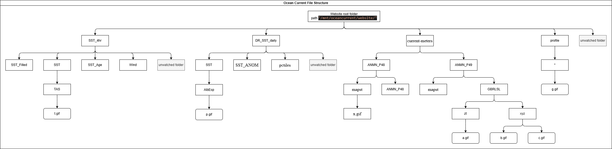

# ARGO Profiles JSON Generator for the Ocean Current website

This script processes directories containing `.gif` files and generates a `profiles.json` file per argo platform directory with metadata extracted from the filenames. The filenames follow a specific pattern, and the extracted information includes the date, profile number, and cycle number.

## Directory Structure

The script expects a directory structure as follows:

/mnt/oceancurrent/website/profiles/
├── platform_code1/
│ ├── YYYYMMDD_profileNumber_cycleNumber.gif
│ ├── YYYYMMDD_profileNumber_cycleNumber.html
│ └── ...
├── platform_code2/
│ ├── YYYYMMDD_profileNumber_cycleNumber.gif
│ ├── YYYYMMDD_profileNumber_cycleNumber.html
│ └── ...
└── ...


Where:
- `YYYYMMDD` is the date.
- `profileNumber` is the profile number.
- `cycleNumber` is the cycle number.

## Script Overview

The script performs the following steps:
1. Lists all platform codes in the specified `PROFILES_PATH` directory.
2. For each platform code, lists all files in the corresponding directory.
3. Filters the filenames to include only `.gif` files.
4. Extracts the date, profile number, and cycle number from each filename using a regular expression.
5. Creates a `profiles.json` file per directory containing the extracted information.

## Usage

### Running the Script

1. Confirm the `PROFILES_PATH` variable in the script to point to the base directory containing the platform code directories.
2. Run the script using Python as a cronjob:

```bash
python3 argo_oceancurrent.py
```

## Unittesting
Run the unittests with ```pytest```

# File Server API for JSON Generator for the Ocean Current website
Script `oceancurrent_file_server_api.py` is used for scanning `.gif` files in the Ocean Current file server for selected subproducts and products. JSON files are generated as per subproducts. The JSON file format is designed as below:
```JSON
[
    {
        "path": "/SST_4hr/SST/Adelaide", # /{product folder}/{subproduct folder}/{region}
        "productId": "fourHourSst-sst", # subproduct ID which align with Ocean Current front-end https://github.com/aodn/ocean-current-frontend/blob/main/src/constants/product.ts
        "region": "Adelaide", # region folder
        "depth": null, # this is used for some products which contains depth attribute
        "files": [
            {
                "name": "2024041918.gif" # scanned gif file existed in the file path "/SST_4hr/SST/Adelaide"
            }
        ]
    },
    {
        "path": "/SST_4hr/SST/SAgulfs",
        "productId": "fourHourSst-sst",
        "region": "SAgulfs",
        "depth": null,
        "files": [
            {
                "name": "2024051010.gif"
            }
        ]
    }
]
```
The file structure is various for difference products, for example, below is an example of structure of the file server. 
**A selected product** is a product which has been implemented on Ocean Current website. Similarly, **a selected subproduct** is a subproduct which has been implemented on Ocean Current website. To scan the `.gif` files under particular product folders, `FILE_PATH_CONFIG` should be a dictionary in which has the file path configurations at a product level. Each key-value pair in `FILE_PATH_CONFIG` is expected to follow this format:
```python
"{product_name}": {
    "rootpath": ["{product_folder}"],
    "subproduct": [
        {"name": "subproduct_name", "path": "subproduct_folder"} 
    ],
    "max_layer": 3,
    "include": None,
    "exclude": None
}
```
The definition of each key are designed as:
1. **product_name**: the name of the product, 
2. **rootpath**: the list of folder names which are the product located in the file server. Ideally, it should be a list of strings. If the product has no specific rootpath, such as `"rootpath": []`, it means this product is located at the website root path.
3. **subproduct**: the list of dicts which configure the subproduct information, including subproduct name and subproduct folder, which is expected to be underneath the product folder. In some cases, the subproduct can be unspecific, such as `"subproduct": []`, the script treats all folders in the product folder as its subproduct.
4. **max_layer**: an integer. This is the max number of folders that the script should loop for (starting from the website root path). This indicates how many folders the script should go through until it reaches the `GIF` file. For example, for a GIF file "example.gif" stored in the "/mnt/oceancurrent/website/GAB/", where "/mnt/oceancurrent/website/" is the website root path, the `max_layer` is 1. This also means the GIF file is accessible through url "https://oceancurrent.aodn.org.au/GAB/example.gif".
5. **include**: Specifies the folders to be explicitly included in the search. This should be provided as a list of dictionaries, where each dictionary defines the folder name and the corresponding layer depth. For example:
```Python
"include": [{"name": "mapst", "layer": 3}]
```
This means that at the third layer in the directory structure (e.g., "layer 1/layer 2/layer 3"), only the folder named "mapst" will be scanned. If this value is set to None, it indicates that there are no specific folder restrictions, and all folders across all layers will be included in the scan.
6. **exclude**: Likewise, this parameter indicates the folders to be explicitly excluded in the search.  This should be provided as a list of dictionaries, where each dictionary defines the folder name and the corresponding layer depth. For example:
```Python
"exclude": [{"name": "mapst", "layer": 3}]
```
This means that at the third layer in the directory structure (e.g., "layer 1/layer 2/layer 3"), only the folder named "mapst" will be skipped (while the rest of other folders at the third layer still to be scanned). Similarly, if it set as None, it means no specific folder need to be excluded in the scan.


In `FILE_PATH_CONFIG`, the product should be properly configured that align with its pattern in the ocean current file server.

The scanning logic is defined as follows:
#### Initialization
1. The script inits with loading: the website rootpath and the predefined `FILE_PATH_CONFIG` with the init function of a `FileStructureExplorer` object. A `FileStructureExplorer` is expected to have these attributes:
- `config`: the `FILE_PATH_CONFIG` for setting up products that are need to be scanned from the file server.
- `root_path`: the root path of the website.
- `watched_product`: a stack of all the product folders nominated in the config. To avoid extreme cases where a folder is shared by multiple product, we simply rename the watched product as `"{product_name}:{product_folder}"`
- `wathced_product_in_root`: a set of products that if the product folder ("rootpath") is empty - which suggests the product locates at the website root path.
- `scanned_product`: a set of products that is scanned by the script. In the init function, it set as empty.

#### Scanning
The scanning function `scan_product()` is a function of an initialised `FileStructureExplorer` object. It can be splitted into (1) scanning products that are distributed at the root path if `wathced_product_in_root` is not empty. And (2) scanning products that is in specific product folders if `watched_product` is not empty with function. Both are recursive and share similar logic design. The scanning logic is designed as below. 

#### JSON Generation
Finally, for each **subproduct**, a JSON file named `"{product_id}.json"` should be generated and saved within the corresponding subproduct folder. In some cases, a product may not have any subproducts, meaning the subproduct configuration is empty. For example, in the Ocean Color product, GIF files are stored directly in regional folders such as: `"/{region}_chl/{YYYYMMDDHH}.gif"`. In such cases, the generated JSON file should be saved at the root path of the product. All files from all regional folders are treated as part of a **single product**, and a single JSON file named `"{product_id}.json"` will represent the entire files.

